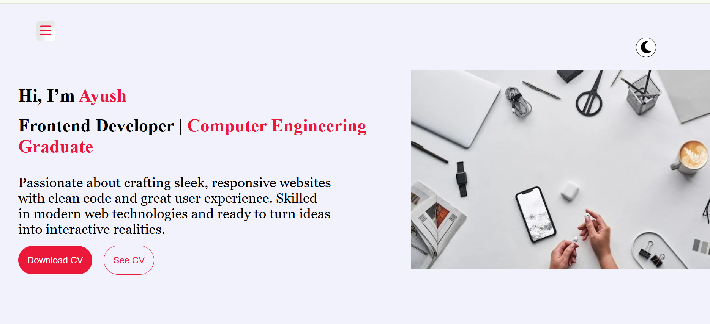
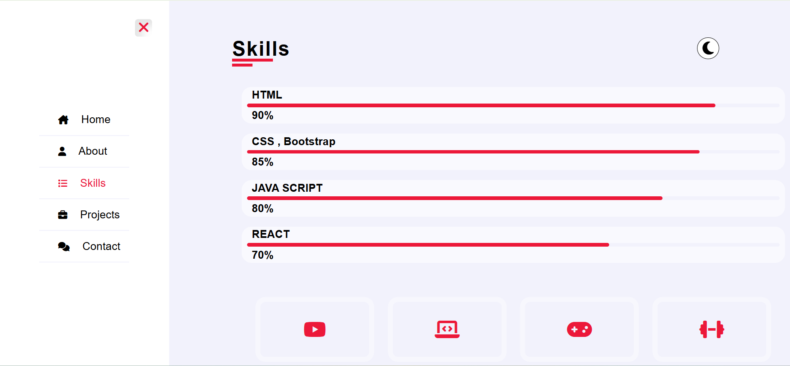
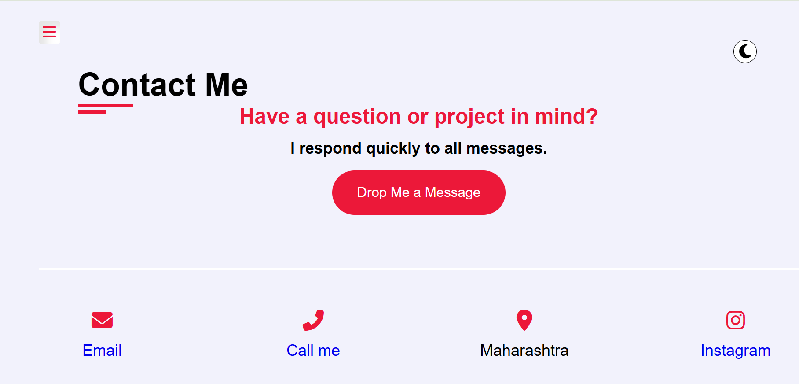
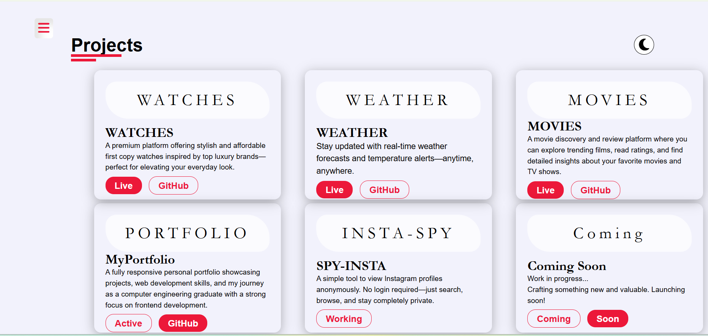
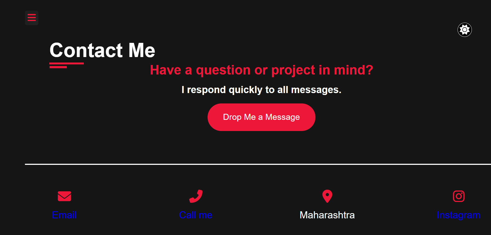

# 🧑‍💻 Ayush – Developer Portfolio

A personal portfolio website built to showcase my skills, projects, and resume as a frontend developer. Designed with responsiveness and simplicity in mind to provide recruiters and developers a clean view of my work.

> 🌐 **Live Site**: https://myresponsiveportfolioa.netlify.app/ <!-- Replace this with your Netlify/Vercel/GitHub Pages link -->

---

## 📸 Preview

 <!-- Optional screenshot -->

---

## 🚀 Features

- 👋 **About Me** – A quick overview of who I am and what I do
- 🧑‍💻 **Projects Section** – Highlights of my top projects with links to GitHub and live demos
- 🛠️ **Skills** – Lists of tools, languages, and technologies I work with
- 📄 **Resume Download** – Direct link to my resume (PDF)
- 📱 **Responsive Design** – Works great on all screen sizes
- 🌐 **Contact Form / Links** – Email, GitHub, Number, etc.

---

## 🛠️ Tech Stack

- **HTML5** – Structure
- **CSS3** – Styling and layout
- **JavaScript (Vanilla)** – Page interaction *(mention which one you used)*
---

## 📁 Folder Structure (Example)

portfolio/
├── index.html
├── css/
│ └── portfolio.css,media-portfolio.css
├── js/
│ └── portfolio.js
├── portfolio/
│ └── 9a.png, resume.png
├── resume.pdf
└── README.md

---

## 🧪 How to Run Locally

1. Download or clone the repository
2. Open index.html in your browser

---

---

## 📸 Additional Screenshots

 

---

🙋‍♂️ About Me
I’m Ayush, a passionate frontend developer with hands-on experience in HTML, CSS, JavaScript, React, and Bootstrap. As a Computer Engineering fresher, I build projects to sharpen my skills and showcase my work through a responsive, cleanly designed portfolio.

📢 Contact
📧 Email: ayushkumbhalkar68@gmail.com

💼 LinkedIn: https://www.linkedin.com/in/ayush-kumbhalkar-440403296 

🐱 GitHub: https://github.com/FrontendwithAyush 

✨ Hosting
Hosted on Netlify  – https://myresponsiveportfolioa.netlify.app/

