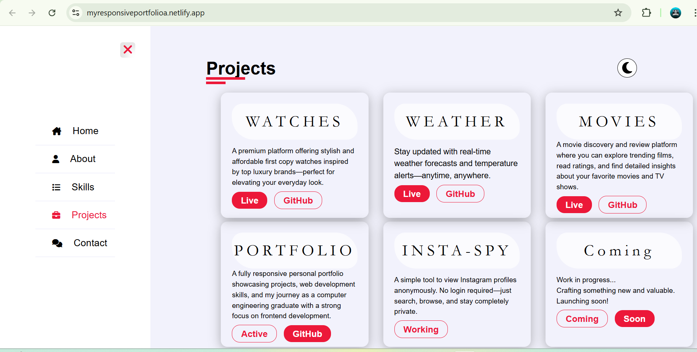

# 🧑‍💻 Ayush – Developer Portfolio

A personal portfolio website built to showcase my skills, projects, and resume as a frontend developer. Designed with responsiveness and simplicity in mind to provide recruiters and developers a clean view of my work.

> 🌐 **Live Site**: [https://myresponsiveportfolioa.netlify.app/] <!-- Replace this with your Netlify/Vercel/GitHub Pages link -->

---

## 📸 Preview

 <!-- Optional screenshot -->

---

## 🚀 Features

- 👋 **About Me** – A quick overview of who I am and what I do
- 🧑‍💻 **Projects Section** – Highlights of my top projects with links to GitHub and live demos
- 🛠️ **Skills** – Lists of tools, languages, and technologies I work with
- 📄 **Resume Download** – Direct link to my resume (PDF)
- 📱 **Responsive Design** – Works great on all screen sizes
- 🌐 **Contact Form / Links** – Email, GitHub, LinkedIn, etc.

---

## 🛠️ Tech Stack

- **HTML5** – Structure
- **CSS3** – Styling and layout
- **JavaScript (Vanilla or React)** – Page interaction *(mention which one you used)*
- **Bootstrap** – *(If used, mention it here)*

---

## 📁 Folder Structure (Example)

portfolio/
├── index.html
├── about.html
├── projects.html
├── contact.html
├── css/
│ └── style.css
├── js/
│ └── main.js
├── images/
│ └── profile.png, preview.png
├── resume.pdf
└── README.md


---

## 🧪 How to Run Locally

```bash
1. Download or clone the repository
2. Open index.html in your browser

🙋‍♂️ About Me
Ayush – A passionate frontend developer with a strong grip on HTML, CSS, JS, React, and Bootstrap.
Currently a Computer Engineering Fresher building projects and learning more about full-stack development.

📢 Contact
📧 Email: [your email]

💼 LinkedIn: [your profile]

🐱 GitHub: [your username]

✨ Hosting
Hosted on Netlify / GitHub Pages / Vercel – [Link here again]


---

### ✅ What You Should Do Next

1. Replace the placeholder `[your link]`, `[your email]`, etc. with your actual info.
2. If your site is deployed, **share the link with me**, and I’ll help add your exact link and screenshot.
3. Add a nice screenshot (`portfolio-preview.png`) for the preview section if you want to show your design on GitHub.

Let me know once you update or if you want help writing any of the sections like “About Me” or uploading your resume PDF.

